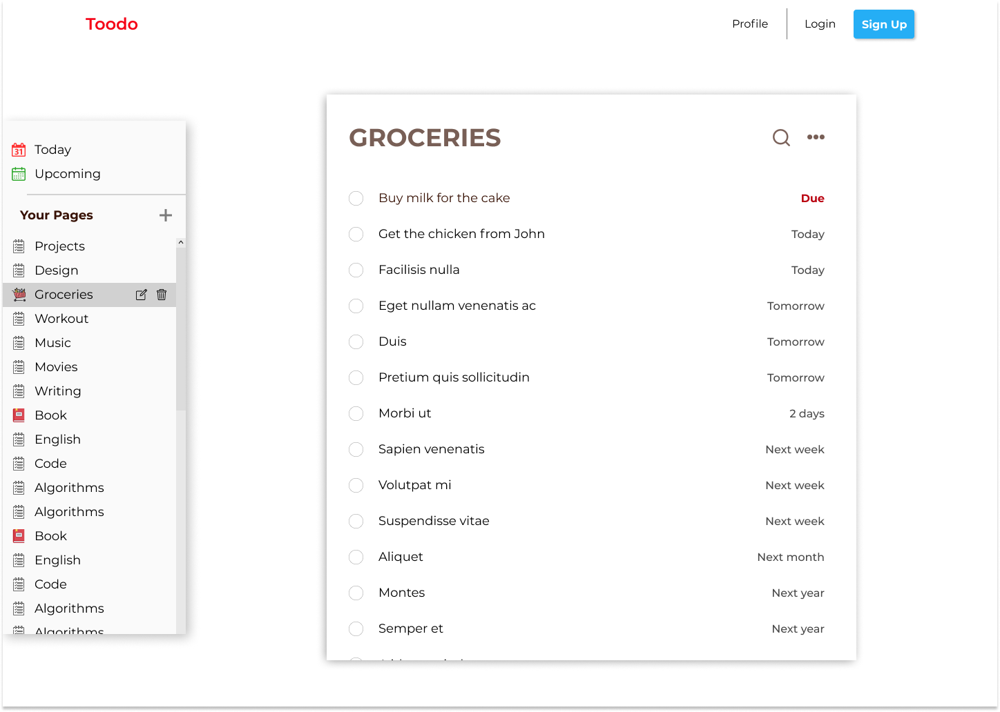

# Fullstack Todo App with Authentication

## Figma Design:

## Frontend
- TypeScript
- React, Redux, React Router, Redux Persist
- Reusable components
- Storybook integration for component documentation
- Design first approach with Figma
- Responsive design and SCSS
- Jest and RTL for testing
- CI integration with Github Actions
- Authentication and authorization
- Deployed to Netlify

## Backend
- Node.js
- Mongoose and Express
- Authentication and authorization
- Bcrypt, JWT and dotenv
- ~Deployed to Heroku~ (App is removed due to free version policy update of Heroku)
